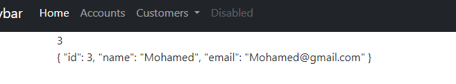
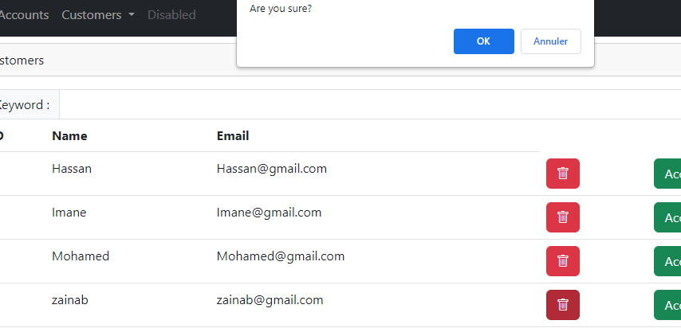
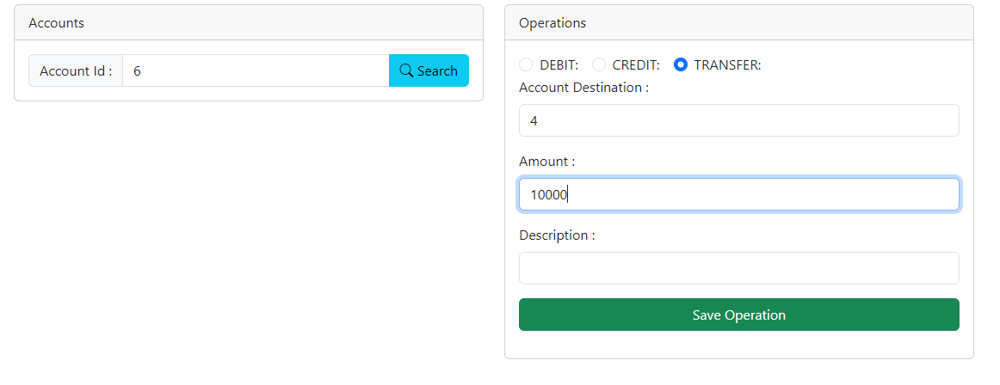
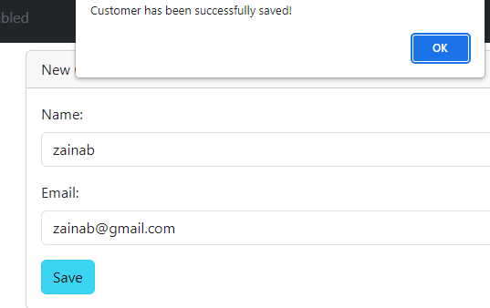

# E-BANK
Le but de ce projet consiste à implémenter une application Web Java EE permettant la gestion de comptes bancaires.
Ce projet concerne la mise en oeuvre des technologies JPA, Hibernate et Spring MVC (pour la couche web de l'application) et angular(pour le front).
L'application respecte les critères suivants :
Elle se compose de trois couches : DAO, Métier et Web ;
L'inversion de conrôle est effectuée par le framework Spring ;
La couche Web est basée sur Spring MVC ;
La mapping ORM (Object Relationnel Mapping) est basé sur JPA et Hibernate ;
La gestion des transactions est assurée par Spring aussi ;
Le framework Spring Security assure la partie sécurité;
le framwork angular assure la partie front-end;

